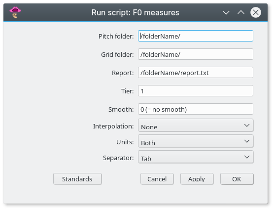

# f0_measures.praat

Praat script to collect descriptive measures of F0.

## Purpose

Collects a set of descriptive measures of F0 from Pitch objects paired with TextGrids. Measures will be collected for every non-empty interval in a selected tier. Pitch and TextGrid files must have the same name.

- **Mean**
- **Median**
- **Baseline**: 7.4th quantile of the F0 sample (see [Reference](#reference))
- **Standard deviation** (SD)
- **Coefficient of variation** (CV): (SD/mean) * 100
- **Quartile coefficient of dispersion**: ((Q3 - Q1)/(Q3 + Q1) * 100)
- **Median absolute deviation** (MAD): median of the deviations from the sample median
- **Basedev**: median absolute deviation from baseline
- **Meandev**: mean - baseline
- **Range**: log2(F0max / F0min) * 12
- **Peak rate**: rate of F0 peaks per second 
- **Interpeak duration CV**: coefficient of variance of duration of time between peaks

## Parameters

Upon running the script, a window like the one below will appear, where the user has to set a number of parameters.

The parameters are:

- **Pitch folder** and **Grid folder**: path of folders where *Pitch* and *TextGrid* files are stored. They can be the same or different folders.
- **Report**: path of the folder and name of the file (with extension) of the report outputted by the script.
- **Tier**: number of the TextGrid tier to be analyzed.
- **Smooth**: how much smoothing should be applied (the greater the number, the smoother the contour). If set to `0`, no smoothing will be applied.
- **Interpolation**: which kind of interpolation apply in voiceless intervals. Options are no interpolation, quadratic or linear.
- **Units**: scale of measurement - Hertz, semitones relative to 1 Hz or both.
- **Separator**: character used to separate columns in the report file - tab, comma or single white space.

## Changelog

See the [CHANGELOG](CHANGELOG.md) file for the complete version history.

## License

See the [LICENSE](LICENSE.md) file for license rights and limitations.

## How to cite

Click on the DOI badge above to see instructions on how to cite the script.

## Reference

Traunmüller, H., and A. Eriksson. n.d. "The Frequency Range of the Voice Fundamental in the Speech of Male and Female Adults." http://www2.ling.su.se/staff/hartmut/f0_m&f.pdf.
